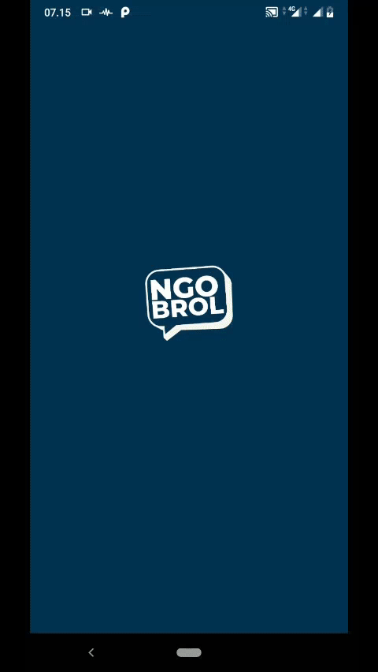

<h1 align='center'>Ngobrol  React Native Chat Apps with Maps</h1>

 

## Introduction

Ngobrol is a Chat Application with maps feature to track/show the user's friend location near to user's current location.

## Requirements

1. <a href="https://nodejs.org/en/download/">Node Js</a>
2. Node_modules `npm install` or `yarn install`

## How to Install

1. Download this Project or you can type `https://github.com/yusufabdillahputra/ngobrol.git`
2. Open app's directory in CMD or Terminal
3. Type `npm install` or `yarn install`
4. Type `react-native run-android`

## Screenshot from the App

